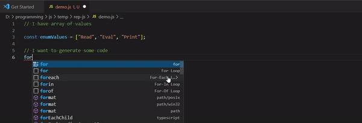

# REP.js

This is an extension for generation of code using js code.

## Demo



## Features

You can just write the code that will generate other code and call 'REP.js: Eval and Print' command of this extension and it will insder generated code right after the code of generator.

Example:

Write this code in your text editor

```javascript
for (let i = 0; i < 10; i++) {
  writeline(i);
}
```

Select all these lines

Run "REP.js: Eval and Print" command

Result:

```javascript
for (let i = 0; i < 10; i++) {
  writeline(i);
}
0;
1;
2;
3;
4;
5;
6;
7;
8;
9;
```

## Globals

You have to functions: `write` and `writeline`.
`write` will transform it's parameters to string and pushes them
`writeline` will do the same as `write` but will insert new line character after it's output.

You also can use `console.log` and `console.warn` and `console.error` - it will be rendered as multiline comments.

Also [lodash](https://lodash.com/docs/4.17.15) and [ramda](https://ramdajs.com/docs/) libraries are available. Use `_` to get lodash and `R` to get ramda.

Example:

```javascript
const vars = ["Read", "Eval", "Print"];
writeline(`const ${_.camelCase(vars.join(""))} = 10`);
```

Will be rendered to

```javascript
const readEvalPrint = 10;
```
